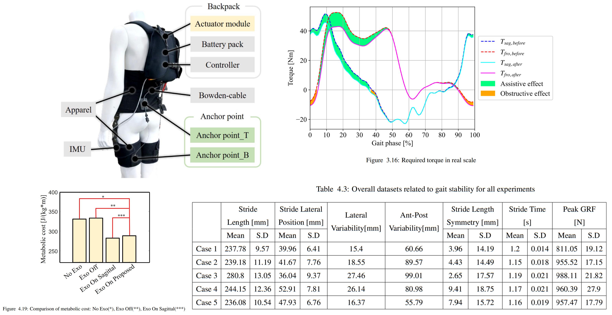

# EXOLAB-HANDOVER

* 아래 repository들에서 소스코드 열람 및 다운로드 가능
* 모든 연구 관련 repository는 private이며, 랩 멤버만 열람 가능 (github ID 공유)
* 각 repo의 Issues 탭에서 버그리포트 및 개선 요청
* **```git clone```이 아닌, ```Download ZIP``` 통해서만 이용할 것 권장합니다 (무료계정이라 꼬이면 관리 불가)**
* **마찬가지로 모든 접근 권한 가진 인원이 코드 수정이 가능하므로, 다운로드해서 개인 코드에서 수정하시길 권장합니다**<br>
  **(git 사용자는 branch 통한 관리 권장)**

## SolidWorks 파일에서 URDF 생성하기

 

* 개발환경: windows
* [sw_urdf_exporter](https://wiki.ros.org/sw_urdf_exporter) 설치
* [Tutorial](https://youtu.be/Id8zVHrQSlE?si=v0TO4Ew7JJsLUWSz)과 같이, Assembly 파일에서 base/joint별 원점과 좌표계, 축 설정 후 link/joint를 지정하여 export<br>
  (자동생성기능은 굉장히 에러가 많으며 joint 좌표계는 이후 제어에서 굉장히 유의미한 값이니, 반드시 수동생성 권장)
* [github repo](https://github.com/sbin-github/myassetsWALKON5)에 지금까지 생성 및 사용한 WalkON5 urdf/USD 저장

<!--
## Dynamics & Pinocchio
* 개발환경: ubuntu/mac
* [pinocchio library (rigid body dynamics solver)](https://github.com/stack-of-tasks/pinocchio) 기반 워크온 응용하기
* 학습 자료: [ETH Zurich Robot Dynamics Textbook](https://ethz.ch/content/dam/ethz/special-interest/mavt/robotics-n-intelligent-systems/rsl-dam/documents/RobotDynamics2017/RD_HS2017script.pdf), [Memmo 2020 summer school](https://memory-of-motion.github.io/summer-school/materials)
* [github repo](https://github.com/sbin-github/WALKON5_SingleGaitWPG_MPC) 내 README 참고
-->

## WPG (Non-linear MPC)


* 개발환경: ubuntu/mac
* [crocoddyl library (mpc solver)](https://github.com/loco-3d/crocoddyl) 기반 MPC를 사용한 stride-by-stride gait pattern generation
* 학습 자료: pinocchio 및 MPC 관련 선행지식, [Memmo 2020 summer school](https://memory-of-motion.github.io/summer-school/materials)
* [발표자료](https://rsckaist.sharepoint.com/:p:/s/RSCLab/EVG7Sl8Mp3JAkbJYEwYBgW4BaW19olpXVQM0K0w0xVxBMQ?e=RmCqWh) (연구실 teams 계정으로 접근 가능)
* [github repo](https://github.com/sbin-github/WALKON5-SingleGaitWPG-MPC) 내 README 참고
* *Possible future works:* 실시간 제어기 개발 기반 확장, WalkON5 제어 응용, RL 응용
  
## WalkON5 Isaac SIM


* 개발환경: ubuntu + NVIDIA 그래픽카드
* WalkON5 simulation platform
* [발표자료](https://rsckaist.sharepoint.com/:p:/s/RSCLab/EYnbRE4QcotIk8Je03JMZ_EBRT5CXE1I-xJF1KuB1XXX_g?e=wNZvNn) (연구실 teams 계정으로 접근 가능)
* [github repo](https://github.com/sbin-github/HRI-SIM-API) 내 README 참고
* *Possible future works:* 제어기 테스트, 비전 응용

## Parameter Adaptation (서현석 학생 졸업주제: 다차원 보조변수 최적화)



* 개발환경: ubuntu/mac/windows
* [서현석 학생 졸업논문 (CH 3 파트)](https://rsckaist.sharepoint.com/:b:/s/RSCLab/EcjUzsVXQWRCifrpdDTI4jQBIHhCOvGPYPCt-9JlK_tMRQ?e=kpeKx0) (연구실 teams 계정으로 접근 가능)
* [github repo](https://github.com/sbin-github/SHS-dissertation) 내 README 참고
* *Possible future works:* 피험자 추가 및 실적화 (진행되지 않았음)

## Deep Learning (Gait Phase & Mode Estimation)


* 개발환경: ubuntu/mac/windows
* [발표자료](https://rsckaist.sharepoint.com/:p:/s/RSCLab/EXVX33B7gThHlFooSdthjWYBimtZKX2jKAyLnqHtSebmpA?e=AUlIu6) (연구실 teams 계정으로 접근 가능)
* [github repo](https://github.com/sbin-github/sbin-github-Handover-GaitPhaseMode) 내 README 참고
* *Possible future works:* 피험자 추가 및 실적화 (진행되지 않았음)
